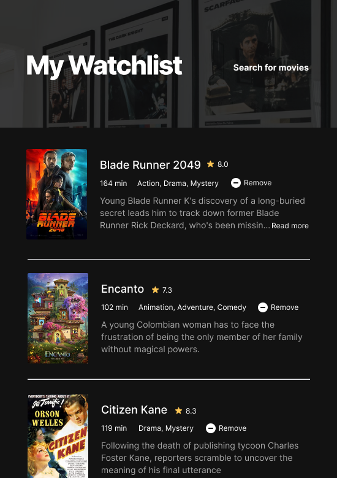

# Movie Watchlist

Scrimba - Module 9 - Working with APIs - Solo project - Movie Watchlist

This project was completed as part of the [Scrimba](https://scrimba.com/) [Frontend Career Path](https://scrimba.com/learn/frontend/) curriculum.

## Live Website

View the [live site](https://m3t4m1k3.github.io/movie-watchlist/)

## Learning Goals

Implement a basic vanilla JavaScript application based on a list of specifications and a Figma design file.

- [ ] HTML, CSS and JavaScript
- [ ] Open Movie DB API
- [ ] Async function calls
- [ ] Local Storage

## Core Requirements

- [ ] Two pages. index.html and watchlist.html
- [ ] Index.html = search page. Calls OMDB API with the title searched for and displays search results.
- [ ] Button to "add to watchlist" which saves the data to local storage.
- [ ] Watchlist.html loads and displays data from local storage

## Design

The design will be as per the the image below specified by the designer. See the complete [Figma project here](https://www.figma.com/file/jhFRdFIdHpRxsDznNXtpXw/Movie-Watchlist?node-id=2%3A17).

## Author

Michael McGee [@m3t4m1k3](https://github.com/m3t4m1k3)

## TODO

- [ ] Add todo
